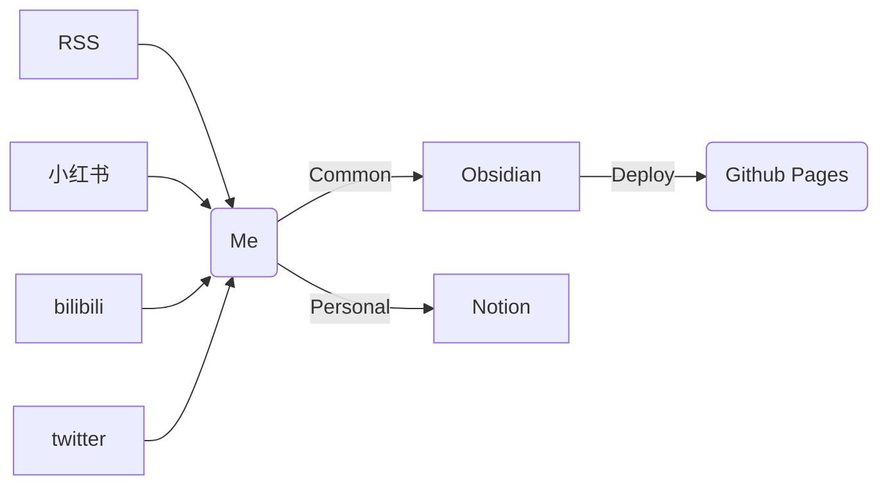

```
- 输入优质信息
- 适当降低输入的频率
```



### 信息输入

- 哔哩哔哩

  用来看视频教程居多，也是处理起来速度最慢的一类

- 小红书

  很适合做新的搜索引擎

  在小红书上搜索过一个条目后，首页上就会全是相关的信息，可以保证短时间大量的获取信息

  *不知道这是小红书算法的特性还是缺陷*

- RSS 订阅

  - 少数派

  - V2EX

  - ...

- 其他, 例如邮件订阅、Telegram 频道
