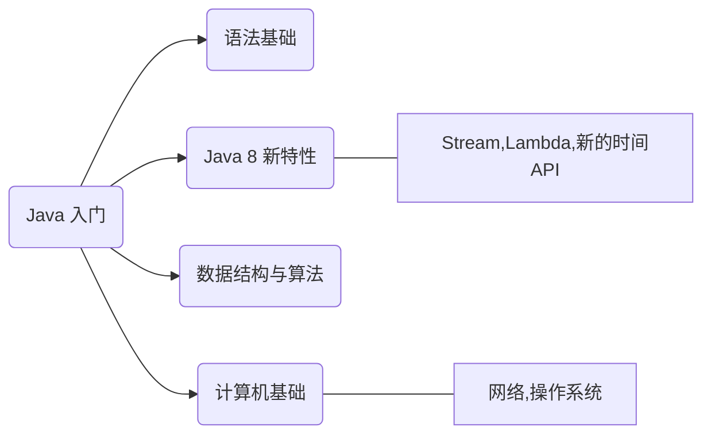
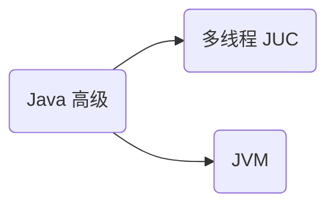
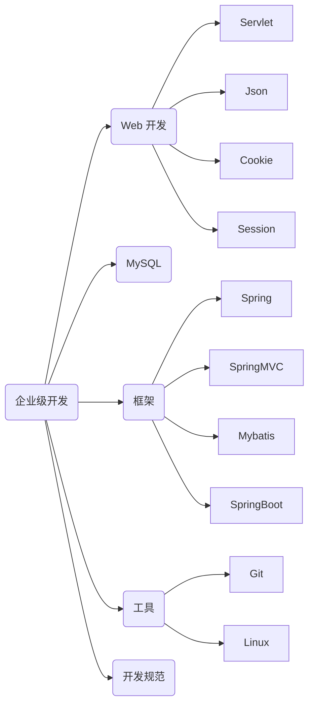
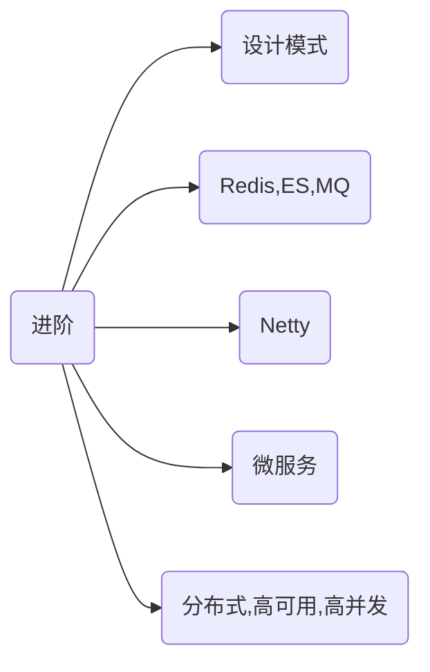

```mindmap
root)学习路线(
  ((Java 基础))
  ((计算机基础))
    网络
    数据结构
    算法
  ((数据库))
    MySQL
    Redis
    ElasticSearch
  ((常用框架))
    Spring
    SpringBoot
    SpringClound
    Mybatis
    Netty
  ((系统设计))
    Web实时消息推送
    延迟消息
    定时任务
    安全
      Token
      敏感词过滤
      数据库脱敏
  ((分布式))
    理论基础
    网关
    分布式id
    RPC
  ((高性能))
    消息队列
    数据库读写分离
    缓存
  ((高可用))
    限流
```

## 针对自己的 Java 学习一条龙

### Java 入门



### Java 高级



### 企业级开发



- 开发规范（阿里巴巴Java开发手册、Google Java Style）

### 进阶



## 程序员学习网站

| 名称                       | 简介                                 |
| ------------------------ | ---------------------------------- |
| [JavaGuide][]            | Java 学习+面试指南基础知识                   |
| [bugstack 虫洞栈][]         | Java 技能树，涵盖大部分Java技术栈              |
| [互联网 Java 工程师进阶知识完全扫盲][] | 涵盖高并发、分布式、高可用、微服务、海量数据处理等领域知识      |
| [互联网公司常用框架源码赏析][]        | 涵盖 Spring、Mybatis、Netty、Dubbo等热门框架 |
| [JVM 底层原理最全知识总结][]       |                                    |
| [Hello 算法][]             | 算法入门好书                             |
| [小林 x 图解计算机基础][]         | 图解网络、操作系统、MySQL、Redis              |
| [深入架构原理与实践][]            |                                    |

**值得一提**的是，「互联网 Java 工程师进阶知识完全扫盲」、「互联网公司常用框架源码赏析」、「JVM 底层原理最全知识总结」是由 Doocs 技术社区总结发布的，该社区还有一些值得一看的项目，有兴趣的也可以看下，[跳转](https://doocs.github.io/#/README_CN?id=项目)

## 文章专栏

- [极客时间程序员精进之路][]

- [面试造火箭 - Java3y][]

- [阿里巴巴 - 技术人生][]

​​<!-- +++++++++ 下面是引用式链接 +++++++++ -->

[JavaGuide]: https://javaguide.cn

[bugstack 虫洞栈]: https://bugstack.cn

[互联网 Java 工程师进阶知识完全扫盲]: https://doocs.gitee.io/advanced-java

[互联网公司常用框架源码赏析]: https://doocs.github.io/source-code-hunter

[JVM 底层原理最全知识总结]: https://doocs.gitee.io/jvm

[极客时间程序员精进之路]: https://www.zhihu.com/column/c_1045311763629350912

[面试造火箭 - Java3y]: https://mp.weixin.qq.com/mp/appmsgalbum?action=getalbum&__biz=MzU4NzA3MTc5Mg==&scene=1&album_id=1657204970858872832&count=3#wechat_redirect

[阿里巴巴 - 技术人生]: https://mp.weixin.qq.com/mp/appmsgalbum?__biz=MzU4NzU0MDIzOQ==&action=getalbum&album_id=2058854698228482051&scene=173&subscene=3&sessionid=undefined&enterid=1633072103&from_msgid=2247494519&from_itemidx=1&count=3&nolastread=1#wechat_redirect

[Hello 算法]: https://www.hello-algo.com/

[小林 x 图解计算机基础]: https://xiaolincoding.com/

[深入架构原理与实践]: https://github.com/isno/theByteBook
