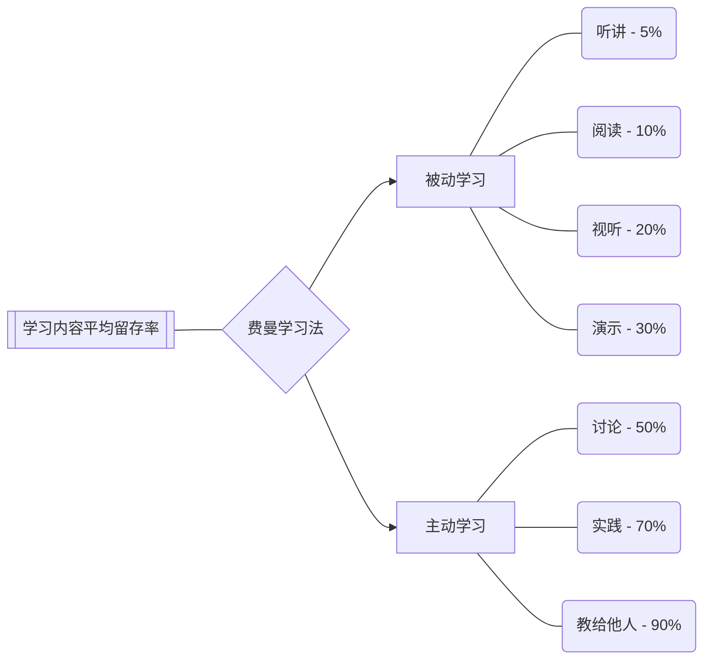

### 费曼学习法

#### **费曼学习法为啥高效**

我们需要将知识教给他人时, 潜意识中就会这个行为产生责任感, 反向推动我们我们学习这块知识

```mermaid
flowchart LR
    
    A{费曼学习法}
    B[被动学习]
    
    B1(听讲 - 5%)
    B2(阅读 - 10%)
    B3(视听 - 20%)
    B4(演示 - 30%)
    
    C[主动学习]
    C1(讨论 - 50%)
    C2(实践 - 70%)
    C3(教给他人 - 90%)
      
    A --> B
    A --> C
    
    B --- B1
    B --- B2
    B --- B3
    B --- B4
    
    C --- C1
    C --- C2
    C --- C3
      
    D[[学习内容平均留存率]] --- A
```
