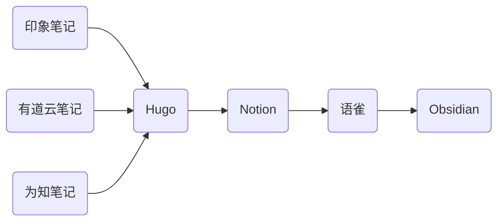

> “工具是为了更好的记录, 不要把时间花在工具身上”

## 个人知识库搭建原则

- 良好的可移植性

  不管是 Notion、语雀或者 FlowUs，采用的文档格式并不能无痛迁移

- 多端支持

  本文利用 `Github Page` 达到移动端查看的效果

- 选择大多数人使用的工具

## 如何搭建一个知识库

**核心部分**

- `Obsidian` - 作为笔记工具记录想法、文档

  - 使用 P.A.R.A 方法管理仓库

    _[The PARA Method: The Simple System for Organizing Your Digital Life in Seconds](https://fortelabs.com/blog/para/)_

  - 配合 `Obsidian Git` 插件, 使用 `Git` 做版本控制, 利用 `Github Action` 在每次代码提交的时候部署到 `Github Page` 供公网访问

  - 配合 `Image auto upload Plugin` 插件, 直接使用 `Command + V` 的方式完成贴图功能

  - 更多插件见同仓库 **「MacOS 软件推荐」系列文章 - Obsidian 插件**

- `VuePress Theme Hope` - 一个具有强大功能的 `VuePress` 主题

  _没听说过 `VuePress` 的小伙伴可以先了解一下_

  `VuePress Theme Hope` 不仅仅是 `VuePress` 的一个主题, 同时包含了许多强大的插件 (例如播客插件、Markdown 增强插件、评论插件等)

  这些插件功能可以帮助建立一个规整、强大的个人文档库, 记录自己所有的想法

### 选择一个图床库 - Github

> **需要提前配置/安装好以下内容, 并熟悉基本用法**
>
> - 本地安装 PicGo
>
> - Obsidian 安装 `Image auto upload Plugin` 插件

Github 仓库作为图床的教程网上一大把, 这里不做赘述

需要注意的是, 存在 Github 仓库的图片因为有些原因访问很慢, 需要搭配免费 CDN 使用

[jsdelivr -  A free CDN for open source projects][]

_如果有 Aliyun OSS、 Tencent COS 服务更好, 图片访问更快更稳定_

### 利用 iconfont 美化文章标题

> 具体配置参考 [VuePress Theme Hope 图标支持][]

- 使用 [iconfont][] 管理网站的图标（资源管理 - 我的项目）

- 选好图标后生成 `css` 文件并引入项目中

- 为 markdown 文件配置 icon 属性

## 碎碎念一下个人文档工具的迁移历史

> 个人文档工具从大学至今经历过比较大的变化
>
> 如下图所示

### 印象、有道云、为知笔记

大学的时候随便找的笔记平台用来记云笔记，记得也是零零碎碎、到处都是的

主打富文本，但是对 `Markdown` 格式支持的并不是很好

_印象笔记很晚才支持 Markdown_

### Hugo

毕业了之后听说每个开发都有自己的博客，所以也找到一个博客框架开始写博客，记的都是一些 「xx 入门」、「xx 教程」之类的文章

~~但是发现没有人看之后，就不想写博客了，哈哈~~

### Notion、语雀

吸引我用 Notion 的是它的颜值，还有就是用 `Page` 嵌套 `Page` 的记录方式，取代了之前文件夹的概念，这一点有点惊艳到我

Notion 的客户端打开很快，在网络环境良好的情况下非常丝滑，页面布局也很好看，UI 很用心

语雀的优势在于本土化，可以直接在国内网络环境下访问，支持协作，而且可以将自己的知识库免费公开分享出去，这一点是我从 Notion 迁移到语雀的主要原因 (虽然客户端优化的不好, 稍微有点卡)

如果不出意外的话我可能会一直用语雀...but (･_･;

**❗️大事件记录❗️**:「22 年 10 月 24 日的语雀会员体系升级」

_v2ex 上有篇帖子专门讨论了这件事情_

- 原文地址: [同学们语雀会员要涨价了](https://www.v2ex.com/t/889628)

- 在 1024 的语雀大会上，语雀升级了会员体系，对免费用户开始变得不太友好，相关情节可以自行查阅

- 国内厂商或多或少存在的通病，“小的时候表现得很慷慨很好用，做大马上涨价收割”

### Obsidian 🥰

首先要说的 Obsidian 并不是一个文档软件，它只是一个 Markdown 编辑器，相比于网上很多人都在推的「双链」功能，我只是将它当作一个有着丰富插件的编辑器

我可以通过插件来提高我写文档的效率，也可以获得一个很不错的编辑体验

最重要的是，我可以专注于我的笔记本身，而不是记录的方式

另外，转移到 Obsidian 并不意味着**完全放弃**使用类似语雀、Notion 之类的笔记软件

## 参考链接

- [VuePress Theme Hope 官方文档](https://vuepress-theme-hope.github.io/v2/zh/guide)

- [LearnData-开源笔记](https://github.com/rockbenben/LearnData)

- [工具癖患者的表现及自我修养](https://www.xianmin.org/post/05-tools-addict/)

​​<!-- +++++++++ 下面是引用式链接 +++++++++ -->

[VuePress Theme Hope 图标支持]: https://vuepress-theme-hope.github.io/v2/zh/guide/interface/icon.html

[iconfont]: https://www.iconfont.cn/manage/index

[jsdelivr -  A free CDN for open source projects]: https://www.jsdelivr.com/?docs=gh
