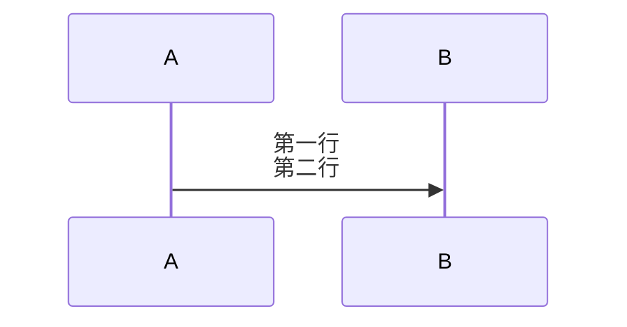

### 引用式链接

之前是这么写链接的

```
这是一个 [链接](链接地址)
```

但是还有一种更加优雅的方式

```
这是一个 [链接id][]

[链接id](链接地址)
```

亦或者

```
这是一个 [链接别名][链接id]
[链接id](链接地址)
```

### Mermaid 高阶用法

#### 流程图内换行

使用传统 HTML 语法 `<br>` 即可



### 参考链接

- [在 Markdown 中使用引用式链接和脚注][]

​​<!-- +++++++++ 下面是引用式链接 +++++++++ -->

[在 Markdown 中使用引用式链接和脚注]: https://client.sspai.com/post/77513
