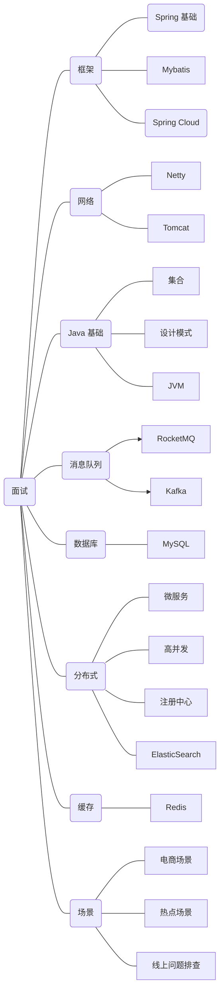

```mermaid
flowchart LR

interview(面试)

framework(框架)
network(网络)
java(Java 基础)
MQ(消息队列)
database(数据库)
distribute(分布式)
cache(缓存)
scene(场景)

interview---framework
interview --- network
interview --- java
interview --- MQ
interview --- database
interview --- distribute
interview --- cache
interview --- scene
  
framework --- f1(Spring 基础)
framework --- Mybatis
framework --- f2(Spring Cloud)

network --- Netty
network --- Tomcat

java --- 集合
java --- 设计模式
java --- JVM

MQ --> RocketMQ
MQ --> Kafka

database --- MySQL

cache --- Redis
  
distribute --- 微服务
distribute --- 高并发
distribute --- 注册中心
distribute --- ElasticSearch

scene --- 电商场景
scene --- 热点场景
scene --- 线上问题排查
```
